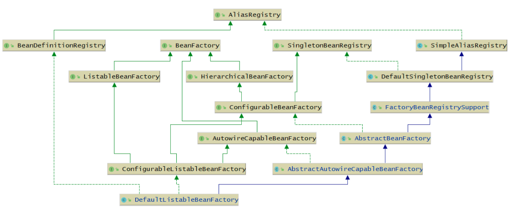

### Spring中基本概念

---

#### BeanDefinition、BeanFactory、Bean的基本概念

- 首先要区分BeanDefinition和Bean对象  BeanDefinition是bean对象的定义，先有beanDefiniton后又Bean对象。 之后就可以在BeanDefinitonMap<name,BeanDefinition>中判断bean有没有定义，拿到beanDefinition，判断scope是不是单例的并且不是懒加载的去单例池中得到，如果单例池中没有则去CreateBean()，如果是prototype，每次都去创建CreateBean()。然后在getBean()方法里面去判断是不是lazy.

#### Bean的生命周期、Bean的后置处理器的概念

- 为什么要有bean的后置处理器，举个例子@Autowired和@Resources Spring有两个不同不类或者逻辑去处理，而且支持你自己定义自己注解 编写自己的后置处理器来处理 

#### BeanDefinition

- 描述bean的对象，我们通过<bean/>，@Bean，@Component等方式所定义的Bean，最终都会被解析为BeanDefinition对象,BeanDefinitio可以理解为底层源码级别的一个概念，也可以理解为Spring提供的一种**API使用**的方式。

- 首先是扫描@Bean或者是xml中的bean标签，生成GenericBeanDenition，保存到beanDefinitionMap中，

- 当getBean的时候，是从MergentBeanDefinition中查找，没有则去beanDefinitionMap得到GenericBeanDenition，判断他有没有parent属性，递归覆盖生成为RootBeanDenition,并存入MergentBeanDefinition

```java
AnnotationConfigApplicationContext applicationContext = new AnnotationConfigApplicationContext();
// 定义了一个BeanDefinition
AbstractBeanDefinition beanDefinition = BeanDefinitionBuilder.genericBeanDefinition().getBeanDefinition();
// 当前Bean对象的类型
beanDefinition.setBeanClass(Person.class);
// 设置作用域
beanDefinition.setScope("prototype");
// 设置初始化方法
beanDefinition.setInitMethodName("init");
// 设置自动装配模型
beanDefinition.setAutowireMode(AutowireCapableBeanFactory.AUTOWIRE_BY_TYPE); 
applicationContext.registerBeanDefinition("p",beanDefinition);
```

#### AnnotatedBeanDefinitionReader

- 可以直接把某个类转换为BeanDefinition，这个类上不用加@Componant注解并且会解析该类上的注解

注意：它能解析的注解是：@Conditional，@Scope、@Lazy、@Primary、@DependsOn、@Role、@Description

```java
AnnotationConfigApplicationContext applicationContext = new AnnotationConfigApplicationContext();
AnnotatedBeanDefinitionReader annotatedBeanDefinitionReader =new AnnotatedBeanDefinitionReader(applicationContext);
//将User.class解析为BeanDefinition
annotatedBeanDefinitionReader.register(Person.class);
applicationContext.refresh();
System.out.println(applicationContext.getBean("person"));
```

#### XmlBeanDefinitionReader

- 可以解析<bean/>标签

```java
XmlBeanDefinitionReader xmlBeanDefinitionReader = new XmlBeanDefinitionReader(applicationContext);
int i = xmlBeanDefinitionReader.loadBeanDefinitions("spring.xml");
System.out.println(i)
```

#### ClassPathBeanDefinitionScanner

- 这个并不是BeanDefinitionReader，但是它的作用和BeanDefinitionReader类似，它可以进行扫描，扫描某个包路径，对扫描到的类进行解析，比如，扫描到的类上如果存在@Component注解，那么就会把这个类解析为一个BeanDefinition

#### BeanFactory

- Spring中比较核心的是BeanFactory的实现类是**DefaultListableBeanFactory**



它实现了很多接口，表示，它拥有很多功能：

1. AliasRegistry：支持别名功能，一个名字可以对应多个别名

2. BeanDefinitionRegistry：可以注册、保存、移除、获取某个BeanDefinition

3. BeanFactory：Bean工厂，可以根据某个bean的名字、或类型、或别名获取某个Bean对象

4. SingletonBeanRegistry：可以直接注册、获取某个**单例**Bean

5. SimpleAliasRegistry：它是一个类，实现了AliasRegistry接口中所定义的功能，支持别名功能

6. ListableBeanFactory：在BeanFactory的基础上，增加了其他功能，可以获取所有BeanDefinition的beanNames，可以根据某个类型获取对应的beanNames，可以根据某个类型获取{类型：对应的Bean}的映射关系

7. HierarchicalBeanFactory：在BeanFactory的基础上，添加了获取父BeanFactory的功能

8. DefaultSingletonBeanRegistry：它是一个类，实现了SingletonBeanRegistry接口，拥有了直接注册、获取某个**单例**Bean的功能

9. ConfigurableBeanFactory：在HierarchicalBeanFactory和SingletonBeanRegistry的基础上，添加了设置父BeanFactory、类加载器（表示可以指定某个类加载器进行类的加载）、设置Spring EL表达式解析器（表示该BeanFactory可以解析EL表达式）、设置类型转化服务（表示该BeanFactory可以进行类型转化）、可以添加BeanPostProcessor（表示该BeanFactory支持Bean的后置处理器），可以合并BeanDefinition，可以销毁某个Bean等等功能

10. FactoryBeanRegistrySupport：支持了FactoryBean的功能

11. AutowireCapableBeanFactory：是直接继承了BeanFactory，在BeanFactory的基础上，支持在创建Bean的过程中能对Bean进行自动装配

12. AbstractBeanFactory：实现了ConfigurableBeanFactory接口，继承了FactoryBeanRegistrySupport，这个BeanFactory的功能已经很全面了，但是不能自动装配和获取beanNames

13. ConfigurableListableBeanFactory：继承了ListableBeanFactory、AutowireCapableBeanFactory、ConfigurableBeanFactory

14. AbstractAutowireCapableBeanFactory：继承了AbstractBeanFactory，实现了AutowireCapableBeanFactory，拥有了自动装配的功能

15. DefaultListableBeanFactory：继承了AbstractAutowireCapableBeanFactory，实现了ConfigurableListableBeanFactory接口和BeanDefinitionRegistry接口，所以DefaultListableBeanFactory的功能很强大

    通过以上分析，我们可以知道，通过DefaultListableBeanFactory我们可以做很多事情，比如：

    ```java
    AbstractBeanDefinition beanDefinition = BeanDefinitionBuilder.genericBeanDefinition().getBeanDefinition();
    beanDefinition.setBeanClass(User.class);
    
    DefaultListableBeanFactory beanFactory = new DefaultListableBeanFactory();
    
    // 注册BeanDefinition
    beanFactory.registerBeanDefinition("user", beanDefinition);
    // 注册别名
    beanFactory.registerAlias("user", "user1");
    // 注册BeanPostProcessor
    beanFactory.addBeanPostProcessor(new LubanBeanPostProcessor());
    
    // 获取Bean对象
    System.out.println(beanFactory.getBean("user1"));
    // 根据类型获取beanNames
    System.out.println(beanFactory.getBeanNamesForType(User.class));
    ```

#### ApplicationContext
- 首先ApplicationContext是个接口，可以把它理解为一个特殊的BeanFactory


1. HierarchicalBeanFactory：拥有获取父BeanFactory的功能

2. ListableBeanFactory：拥有获取beanNames的功能

3. ResourcePatternResolver：资源加载器，可以一次性获取多个资源（文件资源等等

4. EnvironmentCapable：可以获取运行时环境（没有设置运行时环境功能）

5. ApplicationEventPublisher：拥有   bce：拥有国际化功能 

#### 国际化

先定义一个MessageSource:

```java
@Bean
public MessageSource messageSource() {
    ResourceBundleMessageSource messageSource = new ResourceBundleMessageSource();
    messageSource.setBasename("messages");
    return messageSource;
}
```

有了这个Bean，你可以在你任意想要进行国际化的地方使用该MessageSource。

同时，因为ApplicationContext也拥有国家化的功能，所以可以直接这么用：

```java
annotationConfigApplicationContext.getMessage("test", null, new Locale("en_CN"))
```

#### 资源加载

ApplicationContext还拥有资源加载的功能，比如，可以直接利用ApplicationContext获取某个文件的内容：

```java
Resource resource = annotationConfigApplicationContext.getResource("file://D:\\IdeaProjects\\spring-framework\\luban\\src\\main\\java\\com\\luban\\entity\\User.java");
System.out.println(resource.contentLength());
```

你可以想想，如果你不使用ApplicationContext，而是自己来实现这个功能，就比较费时间了。

还比如你可以：

```java
Resource resource = annotationConfigApplicationContext.getResource("classpath:com/luban/entity/User.class");
System.out.println(resource.contentLength());
```

还可以一次性获取多个：

```java
Resource[] resources = annotationConfigApplicationContext.getResources("classpath:com/luban/service/*.class");
for (Resource resource : resources) {
    System.out.println(resource.contentLength());
}
```

这个功能用到了**策略模式**。

#### 获取运行时环境

```java
// 获取JVM所允许的操作系统的环境
annotationConfigApplicationContext.getEnvironment().getSystemEnvironment();

// 获取JVM本身的一些属性，包括-D所设置的
annotationConfigApplicationContext.getEnvironment().getSystemProperties();

// 还可以直接获取某个环境或properties文件中的属性
annotationConfigApplicationContext.getEnvironment().getProperty("xxx")
```

​	注意，也可以将某个properties文件中的参数加载到运行环境中

```java
@PropertySource("classpath:application.properties")
```

#### 事件发布

先定义一个事件监听器

```java
@Bean
public ApplicationListener applicationListener() {
    return new ApplicationListener() {
        @Override
        public void onApplicationEvent(ApplicationEvent event) {
            System.out.println("接收到了一个事件");
        }
    };
}
```

然后发布一个事件

```java
annotationConfigApplicationContext.publishEvent("kkk");
```

#### 类型转化

##### PropertyEditor

JDK中提供的类型转化工具类,Spring也支持jdk的类型转换工具  但是只支持String转其他

```java
public class StringToUserPropertyEditor extends PropertyEditorSupport implements PropertyEditor {

    @Override
    public void setAsText(String text) throws IllegalArgumentException {
        User user = new User();
        user.setName(text);
        this.setValue(user);
    }
}
```

```java
StringToUserPropertyEditor propertyEditor = new StringToUserPropertyEditor();
propertyEditor.setAsText("1");
User value = (User) propertyEditor.getValue();
System.out.println(value);
```

如何向Spring中注册PropertyEditor:

```java
@Bean
public CustomEditorConfigurer customEditorConfigurer() {
    CustomEditorConfigurer customEditorConfigurer = new CustomEditorConfigurer();
    Map<Class<?>, Class<? extends PropertyEditor>> propertyEditorMap = new HashMap<>();
    propertyEditorMap.put(User.class, StringToUserPropertyEditor.class);
    customEditorConfigurer.setCustomEditors(propertyEditorMap);
    return customEditorConfigurer;
}
```

假设现在有如下Bean:

```java
@Component
public class UserService {

    @Value("true")
    User test;

    public void test() {
        System.out.println(test);
    }
}
```

那么test属性就能正常的完成属性赋值

##### ConversionService

Spring中提供的类型转化服务，它比PropertyEditor更强大

```java
public class StringToUserConverter implements ConditionalGenericConverter {

    @Override
    public boolean matches(TypeDescriptor sourceType, TypeDescriptor targetType) {
        return sourceType.getType().equals(String.class) && targetType.getType().equals(User.class);
    }

    @Override
    public Set<ConvertiblePair> getConvertibleTypes() {
        return Collections.singleton(new ConvertiblePair(String.class, User.class));
    }

    @Override
    public Object convert(Object source, TypeDescriptor sourceType, TypeDescriptor targetType) {
        User user = new User();
        user.setName((String)source);
        return user;
    }
}
```

```java
DefaultConversionService conversionService = new DefaultConversionService();
conversionService.addConverter(new StringToUserConverter());
User value = conversionService.convert("1", User.class);
System.out.println(value);
```

如何向Spring中注册ConversionService:

```java
@Bean
public ConversionServiceFactoryBean conversionService() {
    ConversionServiceFactoryBean conversionServiceFactoryBean = new ConversionServiceFactoryBean();
    conversionServiceFactoryBean.setConverters(Collections.singleton(new StringToUserConverter()));

    return conversionServiceFactoryBean;
}
```

##### TypeConverter

整合了PropertyEditor和ConversionService的功能，是Spring内部用的

```java
SimpleTypeConverter typeConverter = new SimpleTypeConverter();
typeConverter.registerCustomEditor(User.class, new StringToUserPropertyEditor());
//typeConverter.setConversionService(conversionService);
User value = typeConverter.convertIfNecessary("1", User.class);
System.out.println(value);
```

#### BeanPostProcessor

- Bean的后置处理器，可以在创建每个Bean的过程中进行干涉，是属于BeanFactory中一个属性

#### BeanFactoryPostProcessor

- Bean工厂的后置处理器，是属于ApplicationContext中的一个属性，是ApplicationContext在实例化一个BeanFactory后，可以利用BeanFactoryPostProcessor继续处理BeanFactory。

- 程序员可以通过BeanFactoryPostProcessor间接的设置BeanFactory，比如上文中的CustomEditorConfigurer就是一个BeanFactoryPostProcessor，我们可以通过它向BeanFactory中添加自定义的PropertyEditor。

#### FactoryBean

- 允许程序员自定义一个对象通过FactoryBean间接的放到Spring容器中成为一个Bean。

- 那么它和@Bean的区别是什么？因为@Bean也可以自定义一个对象，让这个对象成为一个Bean。

- 区别在于利用FactoryBean可以更加强大，因为你通过定义一个XxFactoryBean的类，可以再去实现Spring中的其他接口，比如如果你实现了BeanFactoryAware接口，那么你可以在你的XxFactoryBean中获取到Bean工厂，从而使用Bean工厂做更多你想做的，而@Bean则不行。

拓展:SmartFactoryBean接口，他有个属性，isEagerInit方法默认返回false，为true时，表示立即 ，不为懒加载


---
*[👈 0000 java](0000java.md)*

*[415 出品，必属精品](../note.md)*