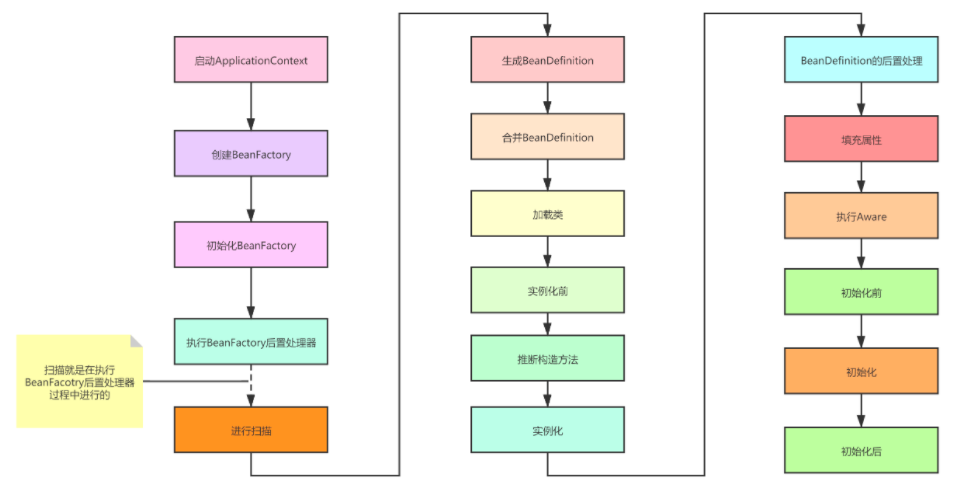

### Bean创建的生命周期步骤


#### Bean的生成过程

##### 生成BeanDefinition

Spring启动的时候会进行扫描，会先调用

```java
Resource[] resources = getResourcePatternResolver().getResources(packageSearchPath);
```

拿到所指定的包路径下的所有文件资源（******.class文件）

然后会遍历每个Resource，为每个Resource生成一个MetadataReader对象，这个对象拥有三个功能：

1. 获取对应的Resource资源
2. 获取Resource对应的class的元数据信息，包括类的名字、是不是接口、是不是一个注解、是不是抽象类、有没有父类，父类的名字，所实现的所有接口的名字，内部类的类名等等。
3. 获取Resource对应的class上的注解信息，当前类上有哪些注解，当前类中有哪些方法上有注解

在生成MetadataReader对象时，会利用**ASM**技术解析class文件，得到类的元数据集信息合注解信息，在这个过程中也会利用ClassLoader去加载注解类（**ClassUtils.getDefaultClassLoader()所获得的类加载器**），但是不会加载本类。

有了MetadataReader对象，就相当于有了当前类的所有信息，但是当前类并没有加载，也是可以理解的，真正在用到这个类的时候才加载。

然后利用MetadataReader对象生成一个ScannedGenericBeanDefinition对象，**注意此时的BeanDefinition对象中的beanClass属性存储的是当前类的名字，而不是class对象**。（beanClass属性的类型是Object，它即可以存储类的名字，也可以存储class对象）

##### 合并BeanDefinition

如果某个BeanDefinition存在父BeanDefinition，那么则要进行合并（GenericBeanDefinition，RootBeanDefinition），BD有个属性（abstract="false" ）代表会不会被实例化为Bean,(parent="parent")代表的是否存在父BD,合并的时候是子BD的属性覆盖掉父BD。

##### 加载类

有了BeanDefinition之后，后续就会基于BeanDefinition去创建Bean，而创建Bean就必须实例化对象，而实例化就必须先加载当前BeanDefinition所对应的class，在AbstractAutowireCapableBeanFactory类的createBean()方法中，一开始就会调用：

```java
Class<?> resolvedClass = resolveBeanClass(mbd, beanName);
```

这个方法就是加载类的，它的实现是：

```java
if (mbd.hasBeanClass()) {
    return mbd.getBeanClass();
}
if (System.getSecurityManager() != null) {
    return AccessController.doPrivileged((PrivilegedExceptionAction<Class<?>>) () ->
        doResolveBeanClass(mbd, typesToMatch), getAccessControlContext());
    }
else {
    return doResolveBeanClass(mbd, typesToMatch);
}
```

```java
public boolean hasBeanClass() {
    return (this.beanClass instanceof Class);
}
```

如果beanClass属性的类型是Class，那么就直接返回，如果不是，则会根据类名进行加载（doResolveBeanClass方法所做的事情）

会利用BeanFactory所设置的类加载器来加载类，如果没有设置，则默认使用**ClassUtils.getDefaultClassLoader()**所返回的类加载器来加载。

**ClassUtils.getDefaultClassLoader()**

1. 优先获取当前线程中的ClassLoader

2. 如果为空，则获取加载ClassUtils类的类加载器（正常情况下，就是AppClassLoader，但是如果是在Tomcat中运行，那么则会是Tomcat中为每个应用所创建的WebappClassLoader）

3. 如果为空，那么则是bootstrap类加载器加载的ClassUtils类，那则获取系统类加载器进行加载

##### 实例化前

允许第三方可以不按照Spring的正常流程来创建一个Bean，可以利用InstantiationAwareBeanPostProcessor的postProcessBeforeInstantiation方法来提前返回一个Bean对象，直接结束Bean的生命周期

##### 推断构造方法

后续单独拿出来看

##### 实例化

构造方法反射得到一个实例

##### BeanDefinition的后置处理

```java
for (BeanPostProcessor bp : getBeanPostProcessors()) {
    if (bp instanceof MergedBeanDefinitionPostProcessor) {
        MergedBeanDefinitionPostProcessor bdp = (MergedBeanDefinitionPostProcessor) bp;
        bdp.postProcessMergedBeanDefinition(mbd, beanType, beanName);
    }
}
```

这里可以处理BeanDefinition，但是此时实例对象已经生成好了，所以修改beanClass已经没用了，但是可以修改PropertyValues，比如

```java
@Component
public class LubanMergedBeanDefinitionPostProcessor implements MergedBeanDefinitionPostProcessor {

    @Override
    public void postProcessMergedBeanDefinition(RootBeanDefinition beanDefinition, Class<?> beanType, String beanName) {
        if (beanName.equals("userService")) {
            beanDefinition.setBeanClass(User.class); // 没用
            beanDefinition.getPropertyValues().add("name","xxx");
        }
    }
}
```

##### 填充属性

单独再看

##### 执行Aware

1. ((BeanNameAware) bean).setBeanName(beanName);
2. ((BeanClassLoaderAware) bean).setBeanClassLoader(bcl);
3. ((BeanFactoryAware) bean).setBeanFactory(AbstractAutowireCapableBeanFactory.**this**);

##### 初始化前

```java
for (BeanPostProcessor processor : getBeanPostProcessors()) {
    Object current = processor.postProcessBeforeInitialization(result, beanName);
    if (current == null) {
        return result;
    }
    result = current;
}
```

##### 初始化

1. ((InitializingBean) bean).afterPropertiesSet();
2. 执行BeanDefinition中指定的初始化方法

##### 初始化后

```java
for (BeanPostProcessor processor : getBeanPostProcessors()) {
    Object current = processor.postProcessAfterInitialization(result, beanName);
    if (current == null) {
        return result;
    }
    result = current;
}
```

### Bean销毁的生命周期步骤

1. 容器关闭、

2. 发布ContextCLosedEvent事件

3. 调用lifecycleProcessor的OnClosed方法

4. 销毁单例Bean

   1. 找出所有DisposableBean(实现了DisposableBean接口的Bean)

   2. 遍历每个DisposableBean

   3. 找出依赖了当前DisposableBean的其他Bean，将这些Bean从单例池中移除掉

   4. 调用DisposableBean的destroy()方法

   5. 找到当前DisposableBean所包含的inner beans，将这些Bean从单例池中移除掉 
   
    这里涉及到一个设计模式：适配器模式
    
    
---
*[👈 0000 java](0000java.md)*

*[415 出品，必属精品](../note.md)*