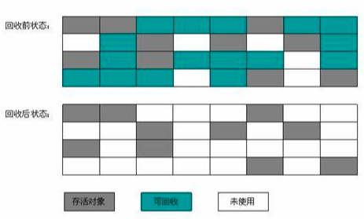
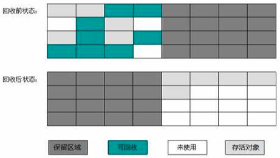
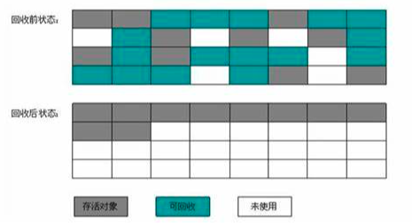

### 垃圾收集算法

  - 从判定对象消亡的角度出发，垃圾回收算法分为两种：“引用计数器式垃圾收集”和“追踪式垃圾收集”，也常被成为“直接垃圾收集”和“间接垃圾收集”，引用计数式垃圾收集 在java中未被涉及， 暂不做记录，主要分析学习追踪式垃圾收集

#### 分代收集理论

  - 分代收集名为理论，大多数的商业虚拟机都遵循此理论，实质是一套符合大多数程序运行实际情况的经验法则

它建立在两个分代假说之上：

1. 弱分代假说：绝大多数的对象都是朝生夕死的

2. 强分代假说：经历过多次垃圾收集过程的对象就越难消亡

  这两个分代假说奠定了多款常用垃圾收集器的一致原则：Java堆分出不同的区域，然后将回收对象的年龄（经历垃圾回收过程的次数）分配到各个区域中，显而易见，如果把大量的朝生夕死的对象集中到一个区域，每次回收只要关注如何保留极少的存活对象，而不是标记那些大量要被回收的对象，就能做到，低代价回收大量的空间，再把剩下的难以消亡的对象，集中到一起，虚拟机便可以用较低的频率来回收这个区域，这样就兼顾了垃圾回收的时间开销和内存空间的有效利用。

假设：新生代中的对象是完全有可能被老年代所引用，为了找到该区域的存活对象，不得不在固定的GC Roots之外，额外便利整个老年代所有对象确保可达性分析结果的正确性，反之亦然，遍历整个老年代理论可以，但是回味内存回收带来很大的性能负担，所以不得不对垃圾回收理论添加第三条经验法则

3. 跨代引用假说

  在相互引用关系的两个对象，是应该倾向于同生共死，举个例子，一个新生代对象存在跨年代引用，由于老年代对象难以消亡，该引用使得新生代同样得以存活，进而年龄增长晋升到老年代，这时跨年代即被消除了，

根据这个理论，我们不必去遍历整个老年代，也不必浪费空间记录那个对象是跨年代的，只需在年轻代上建立一个数据结构（名为“记忆集”，Remmembered Set）,这个结构把老年代分为若干个小块，标志哪个小块被跨代引用，发生新生代GC的时候，这一小块内存也会被加入到GC Roots中进行扫描。虽然这种方法需要在对象上改变引用关系(如将自己或者一个属性赋值)时维护记录数据的正确性。会增加一部分花销，但是对比扫描整个老年代是划算的。

注意：Partial GC（部分收集）：收集一部分年轻代或者老年代，又分为

​				Minjor Gc/Yong GC: 新生代的垃圾收集

​				Major GC/Old GC: 老年代的垃圾回收，目前只有CMS收集齐单独收集老年代

​				Mixed GC：混合收集，整个新生代以及部分老年代，目前只有G1收集器有这种行为

​			    Full GC：整堆收集，收集整个堆和方法区

##### 标记-清除算法

- 最早最基础的垃圾收集算法，分为标记和清除两个阶段，首先标记要回收的对象，标记完成之后，统一回收所有标记的对象，反之亦然，标记存活的对象，统一回收未被标记的对象。

缺点：
    1.执行效率不稳定，如果堆中有大量对象，而且大部分要垃圾回收，这时要进行大量标记和清除动作，导致标记和清除两个过程的执行效率都随着对象数量增长而降低。
    
​	2.内存空间碎片问题，出现大量不连续的内存碎片，空间碎片太多可能会导致如果需要分配较大对象时，无法找到足够的内存而不得不提前触发一次垃圾回收动作。

#### 标记-复制算法

- 简称复制算法或叫做半区复制，为了解决标记-清除算法面对大量可回收对象时，执行效率低的问题。

将可用内存按容量划分为大小相等的两块，每次只使用其中的一块，当这一块用完了，将还活的对象复制到另外一块，然后将已使用过内存空间一次清理掉。对于多数对象都是可回收的情况，算法只需要复制少量的存活对象，而且是针对整个半区进行内存回收，分配内存是也不用考虑空间碎片的问题，只需要移动指针，按顺序分配即可，实现简单，高效。

缺点：
​	1.如果多数对象是存活的，这种算法将会产生大量的内存间复制的开销。

​	2.他的代价是将内存缩小到一半，空间浪费未免太多。

- **更量化的阐释**：新生代中98%的对象都熬不过第一轮收集，所以并不需要按照1:1的比例来划分新生代的内存空间

- **Appel式回收**：把新生代分为一块大的Eden空间和两块小的Servivor空间，每次分配都只分配Eden和其中一块Servivor，发生垃圾回收时，将这两块中存活的对象复制到另外一块Servivor空间，，然后直接清理掉Eden和已经用过的Servivor空间，大小比例为8:1:1，也就是说有个Servivor空间会被“浪费”掉。

- **逃生门的安全设计**： 如果Servivor空间不足以容纳一次Minor GC之后的存活对象，就需要依赖其他的内存区域，从未进行内存担保。

- **内存担保**：直接进入老年代。

#### 标记-整理算法

- ​	标记过程与标记-清除一样的过程，后续不是对回收对象进行清理，而是所有存活对象向着内存空间一侧进行移动，然后直接清理掉边界以外的内存。

-   标记-清除与标记-整理的本质差异在于前者是一种非移动的回收算法，而后者是移动式的。是否移动存活对象是一项优缺点并存的风险决策。

缺点：
    1. 如果大量对象存活，尤其老年代这种每次回收大量对象存活区域，移动对象和更新引用是极其繁重的操作，而且移动这些对象，必须暂停全部用户应用程序才能进行，称之为“STW” "Stop The World".
    
思考： 

​	1.繁重的操作和STP。

​	2.如果跟标记-清除算法一样完全不考虑移动和整理存活对象，空间碎片化问题只能依赖复杂的内存分配器和内存访问来解决，例如“分区空闲链表”来解决内存分配问题，会增加额外的负担，增加吞吐量。

基于以上两点，是否移动对象，移动则回收时会更加复杂，不移动则内存分配复杂，从停段时间来看吗，不移动更短，从吞吐量来看，移动最划算。(关注吞吐量 Parallel Scavaenge，关注延迟CMS)

**和稀泥式**平时采用标记-清理  暂时容忍空间碎片，碎片化成都大到影响内存分配时标记-整理，以获得规整内心（CMS）  

---
*[👈 0003 虚拟机](0003虚拟机.md)*

*[👈 0000 java](0000java.md)*

*[415 出品，必属精品](../note.md)*