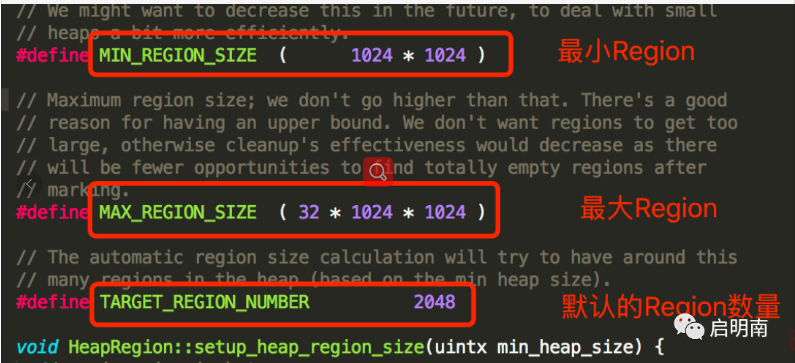
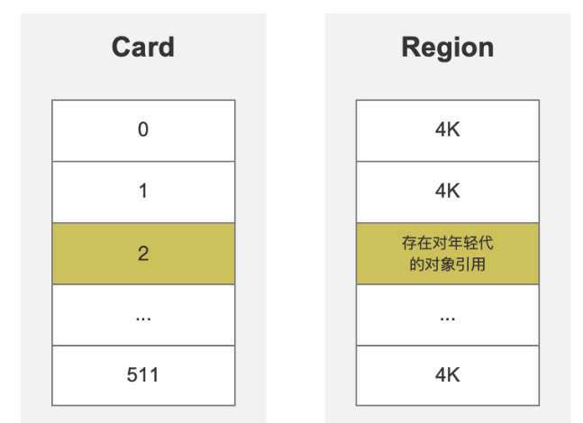

### HotSpot的算法实现细节

#### 根节点枚举

  可达性分析算法是从GC Roots集合找到引用链这个操作作为介绍虚拟机高效实现的第一个例子。

  作为GC Roots的节点主要在**全局性的引用(例如常量或类静态属性)和执行上下文（例如栈帧中的本地变量表）**，虽目标明确，但是查找过程高效并不易。

迄今为止，所有收集器在根节点枚举这一步骤都必须暂停用线程,及面临“**Stop The World**”的困扰，虽说现在可达性分析算法耗时最长的查找引用链的过程可以做到与用户线程并发，但是根节点枚举始终是一个保障一致性的快照中才得以进行，不会出现在分析过程中,根节点集合还是变化的，这点不满足，分析结果的准确性也不能保证，所以这导致垃圾收集过程必须停顿所有用户县城的重要原因，即使听段时间可控（几乎不发生停顿）CMS、G1、ZGC垃圾回收器，**枚举根节点时必须要停顿**的。

  目前主流Java虚拟机使用的都是准确式垃圾收集，当所有用户线程停顿下来之后，并不需要一个不漏的检查所有执行上下文和全局的引用位置，虚拟机可以从某个地方得到哪些地方存放着对象引用的。

eg: HotSpot解决方案中，

1. OopMap数据结构来达到这个目的， 一旦类加载完成，就会把对象内什么偏移量上是什么类型计算出来。

2. 即时编译过程中,也会在特定位置记录下栈和寄存器中哪些位置是引用。

这样并不需要一个不漏的真正从方法区等GC Roots开始查找

#### 安全点

- HotSopt依靠OopMap这个数据结构，可以快速的完成GC Roots枚举，引用关系变化，或者说导致OopMap内容变化的指令非常多，为每一个指令分配一个OopMap需要大	量的额外存储空间，导致垃圾收集伴随的空间成本高昂。
所以只在特定的位置**记录这些信息，称为安全点**，有了安全点的设定，也就决定了用户程序执行时并非在代码指令流任意位置都能停顿下来进行垃圾收集，而是强制要求：执行到安全点后才能够暂停。

#### 安全点的选定

- “具有让程序长时间执行的特征”，因为每条指令运行时间非常短暂，不太可能因为指令流长度太长而长时间执行，“长时间执行”显著特征是指令序列的重复使用。

    eg：方法调用、循环跳转、异常跳转都属于指令序列复用，这些指令才会产生安全点。

1. 不能太少以至于让垃圾收集时间过长。

2. 也不能过于频繁以至于过分增大运行时的内存负荷。

#### 问题
- 如何让垃圾收集时让所有线程（不包括JNI调用的线程）都跑到最近的安全点。

解决方案： 

1.抢占式中断

  不需要线程执行代码主动配合，垃圾收集时，系统首先把所有用户线程全部中断，如果发现有用户线程中断的地方不在安全点上，就恢复这条线程执行，让他重新执行，知道跑到安全点上。机会没有虚拟机实现此方式

2.主动式中断

  当垃圾收集需要中断线程的时候，不直接对线程操作，仅仅简单的设置一个标志位，各个线程都会不断去主动轮训这个标志，一旦发现中断标识为真时，在最近的安全点中断挂起，轮训标记的地方和安全点是重合的，另外还要加上所有创建的对象和其他需要在java堆上分配内存的地方，这是为了检查是否将要立即垃圾收集，能有足够内存分配新对象。
  
### 安全区域

#### 为什么引入

-   安全点机制保证了程序执行时，但是程序不执行的时候呢，经典场景用户线程处于Sleep Bokcke的状态，
  
  这时候线程无法响应虚拟机的中断请求，不能走到安全的地方中断挂起自己，虚拟机也不能持续等待重新被激活分配处理器时间，这时引入安全区域。
  
#### 什么是安全区

- 安全区域是指确保在某一段代码片段中，引用关系不会发生变化，因此，在这个区域中任何地方开始垃圾收集都是安全的，可以看做是拉伸的安全点。
 
- 当用户线程执行到安全区域里面代码时，首先会标致自己进入了安全区域，这段时间内，发生垃圾收集时，不必管这些生命在安全区域内的线程，当离开安全区域的时候，去检查是否完成了根节点枚举（需要暂停其他用户县城），如果完成了，则继续执行，否则必须一直等待，直到收到可以离开安全区域的信号。

###  记忆集和卡表

-   为了解决跨代引用来带的问题，避免把整个老年代加进DC Roots扫描范围，垃圾回收器在新生代建立名为记忆集的数据结构，实际上并不单指新生代、老年代直接跨代引用的问题，涉及部分区域收集行为，都几乎面临这样的问提。

#### 记忆集(Remembered Set)

 - 一种记录从非收集区域指向收集区域集合的抽象数据类型，不考虑效率和成本，最简单实现就是，非收集区域中所有含跨代引用的对象数组来实现这个数据结构,而实际的垃圾回收器只需要通过记忆集判断出某一非收集区域是否存在有指向收集区域的指针就可以了，并不需要实现这跨年代的所有细节，所以实现记忆集的时候，选择更为粗狂的记录力度来节省记忆集的存储和维护成本

#### 记录精度

1. 字长精度

   精确到机器字长，该字节包含跨代指针。(处理器的寻址位数，32位或者64位，决定机器访问物理内存地址的指针长度)

2. 对象精度

   精确到一个对象，该对象有字段包含跨代指针  

3. 卡精度

   精确到一块内存区域，该区域内有对象含有跨代指针
   
#### 卡表(Card Table)

- 第三种“卡精度”所指成为**“卡表”（Card Table）**的方式实现记忆集，也是目前最常用的一种记忆集实现形式。

- 记忆集是一种抽象的数据结构，只定义了行为意图，无具体实现，卡表是一种记忆集的具体实现，它定义了记忆集的记录精度、与堆内存的映射关系等。

- 最简单的形式是一个字节数组（使用byte数组而不是bit数组，主要是考虑速度上的考量，都是按照最小字节寻址，若使用bit则多消耗几条shift+mask指令）

- 字节数组CARD_TABLE 每一个元素对应其标识的内存区域中一块特定大小的内存，这块内存被称为“卡页”（Card Page），一般来讲都是2的N次幂，HotSpot为2的9次幂，512字节，一个卡页的内存中通常包含不只一个对象，只要卡页内有一个或者多个对象的字段存在跨代指针，那就将对应的卡表的数组元素支标为1，成为变脏（Drity），没有则标为0,当垃圾收集发生时，只要筛选出卡表中变脏的元素，就能容易找出内存中包含跨时代指针，把他们加入到GC Roots。

### 记忆集与卡表实现原理

#### Region

- G1及其后出现的垃圾收集器ZGC、Shenandoah，它们都是基于Region的内存布局形式。它们垃圾收集的目标范围不再是整个新生代（Minor GC）、老年代（Majon GV）、整个堆（Full GC），而是一个一个的Region。因为这样的内存布局，所以G1能做到面向局部收集。

- 每个Region都可以被标记为E（Eden）、S（Survivor）、O（Old）、H（Humongous），但一个Region同一时刻只能是这四个中的一个。H表示巨型对象，即超过Region大小的一半的对象，会直接进入老年代由多个连续的Region存储。

- Region的大小可以通过-XX:G1HeapRegionSize参数指定，如果没有显示指定，则G1会计算出一个合理的大小。Region的取值范围为1M~32M，且应为2的N次幂，所以Region的大小只能是1M、2M、4M、8M、16M、32M。比如-Xmx=16g -Xms=16g，则Region的大小等于16G / 2048=8M。也可以推理出G1推荐的管理的最大堆内存是64G。

#### RSet(Remembered Set、记忆集)

- 在垃圾收集过程中，会存在一种现象，即跨代引用，在G1中，又叫跨Region引用。如果是年轻代指向老年代的引用我们不用关心，因为即使Minor GC把年轻代的对象清理掉了，程序依然能正常运行，而且随着引用链的断掉，无法被标记到的老年代对象会被后续的Major GC回收。如果是老年代指向年轻代的引用，那这个引用在Minor GC阶段是不能被回收掉的，那如何解决这个问题呢？

- 最简单的实现方式当然是每个对象中记录这个跨Region引用记录，GC时扫描所有老年代的对象，显然这是一个相当大的Overhead。为什么呢？因为IBM做过这样的实验，发现绝大多数对象都是“朝生夕灭”，等不到进入老年代，能进入老年代的对象最多不到5%。JVM的新生代内存比例是8:1:1也是基于这个结论设定的。

- 最合理的实现方式自然是记录哪些Region中的老年代的对象有指向年轻代的引用。GC时扫描这些Region就行了。这就是RSet存在的意义。RSet本质上是一种哈希表，Key是Region的起始地址，Value是一个集合，里面存储的元素是卡表的索引号（第几个Card的第几个元素）。

#### Card Table(卡表)

- 每个Region又被分成了若干个大小为512字节的Card，这些Card都会记录在全局卡表中。Card中的每个元素对应着其标识的内存区域中一块特定大小的内存块，这个内存块被称为卡页。一个卡页的内存中通常不止一个对象，只有卡页中有一个及以上对象的字段存在着跨Region引用，这个对应的元素的值就标识为1。
  
- 比如G1默认的Region有2048个，默认每个Region为2M，那每个Region对应的Card的每个元素对应的卡页的大小为2M / 512=4K，即这4K内存中只要有一个或一个以上的对象存在着跨Region对年轻代的引用，这个卡页对应的Card的元素值为1。

---
*[👈 0003 虚拟机](0003虚拟机.md)*

*[👈 0000 java](0000java.md)*

*[415 出品，必属精品](../note.md)*