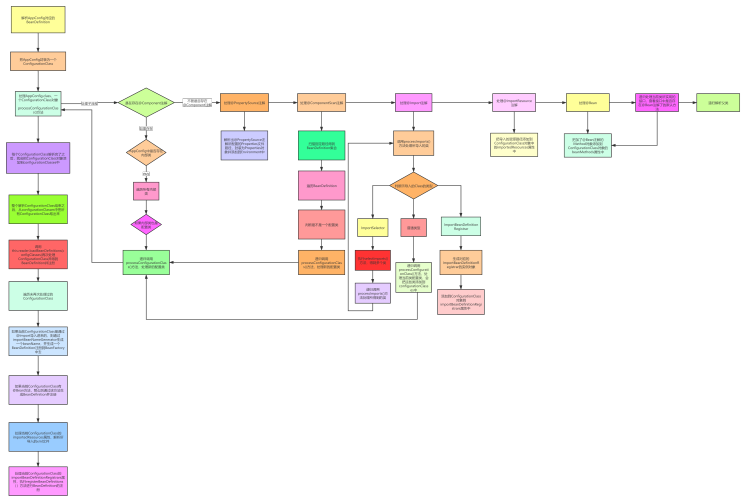

### Spring解析配置类以及扫描源码解析
---
#### 执行BeanFactoryPostProcessor

- 执行通过ApplicationContext添加进来的BeanDefinitionRegistryPostProcessor的postProcessBeanDefinitionRegistry()方法
- 执行BeanFactory中实现了PriorityOrdered接口的BeanDefinitionRegistryPostProcessor的postProcessBeanDefinitionRegistry()方法
- 执行BeanFactory中实现了Ordered接口的BeanDefinitionRegistryPostProcessor的postProcessBeanDefinitionRegistry()方法
- 执行BeanFactory中其他的BeanDefinitionRegistryPostProcessor的postProcessBeanDefinitionRegistry()方法
- 执行上面所有的BeanDefinitionRegistryPostProcessor的postProcessBeanFactory()方法
- 执行通过ApplicationContext添加进来的BeanFactoryPostProcessor的postProcessBeanFactory()方法
- 执行BeanFactory中实现了PriorityOrdered接口的BeanFactoryPostProcessor的postProcessBeanFactory()方法
- 执行BeanFactory中实现了Ordered接口的BeanFactoryPostProcessor的postProcessBeanFactory()方法
- 执行BeanFactory中其他的BeanFactoryPostProcessor的postProcessBeanFactory()方法

#### 执行配置类

1. 在启动Spring时，需要传入一个AppConfig.class给ApplicationContext，ApplicationContext会根据AppConfig类封装为一个BeanDefinition，这种BeanDefinition我们把它称为配置类BeanDefinition。
2. ConfigurationClassPostProcessor中会把配置类BeanDefinition取出来
3. 构造一个ConfigurationClassParser用来解析配置类BeanDefinition，并且会生成一个配置类对象ConfigurationClass
4. 如果配置类上存在@Component注解，那么解析配置类中的内部类（这里有递归，如果内部类也是配置类的话）
5. 如果配置类上存在@PropertySource注解，那么则解析该注解，并得到PropertySource对象，并添加到environment中去
6. 如果配置类上存在@ComponentScan注解，那么则解析该注解，进行扫描，扫描得到一系列的BeanDefinition对象，然后判断这些BeanDefinition是不是也是配置类BeanDefinition（只要存在@Component注解就是配置类，所以基本上扫描出来的都是配置类），如果是则继续解析该配置类，（也有递归），并且会生成对应的ConfigurationClass
7. 如果配置类上存在@Import注解，那么则判断Import的类的类型：
  a. 如果是ImportSelector，那么调用执行selectImports方法得到类名，然后在把这个类当做配置类进行解析（也是递归）
  b. 如果是ImportBeanDefinitionRegistrar，那么则生成一个ImportBeanDefinitionRegistrar实例对象，并添加到配置类对象中（ConfigurationClass）的importBeanDefinitionRegistrars属性中。
8. 如果配置类上存在@ImportResource注解，那么则把导入进来的资源路径存在配置类对象中的importedResources属性中。
9. 如果配置类中存在@Bean的方法，那么则把这些方法封装为BeanMethod对象，并添加到配置类对象中的beanMethods属性中。
10. 如果配置类实现了某些接口，则看这些接口内是否定义了@Bean的默认方法
11. 如果配置类有父类，则把父类当做配置类进行解析
12. AppConfig这个配置类会对应一个ConfigurationClass，同时在解析的过程中也会生成另外的一些ConfigurationClass，接下来就利用reader来进一步解析ConfigurationClass
  a. 如果ConfigurationClass是通过@Import注解导入进来的，则把这个类生成一个BeanDefinition，同时解析这个类上@Scope,@Lazy等注解信息，并注册BeanDefinition
  b. 如果ConfigurationClass中存在一些BeanMethod，也就是定义了一些@Bean，那么则解析这些@Bean，并生成对应的BeanDefinition，并注册
  c. 如果ConfigurationClass中导入了一些资源文件，比如xx.xml，那么则解析这些xx.xml文件，得到并注册BeanDefinition
  d. 如果ConfigurationClass中导入了一些ImportBeanDefinitionRegistrar，那么则执行对应的registerBeanDefinitions进行BeanDefinition的注册

#### 总结

- 解析AppConfig类，生成对应的ConfigurationClass
- 再扫描，扫描到的类都会生成对应的BeanDefinition，并且同时这些类也是ConfigurationClass
- 再解析ConfigurationClass的其他信息，比如@ImportResource注解的处理，@Import注解的处理，@Bean注解的处理
---
*[👈 0000 Java目录](../../0000Java目录.md)*

*[415 出品，必属精品](../../../note.md)*