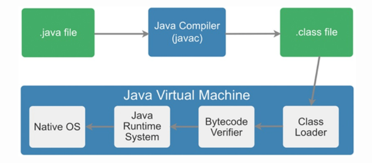
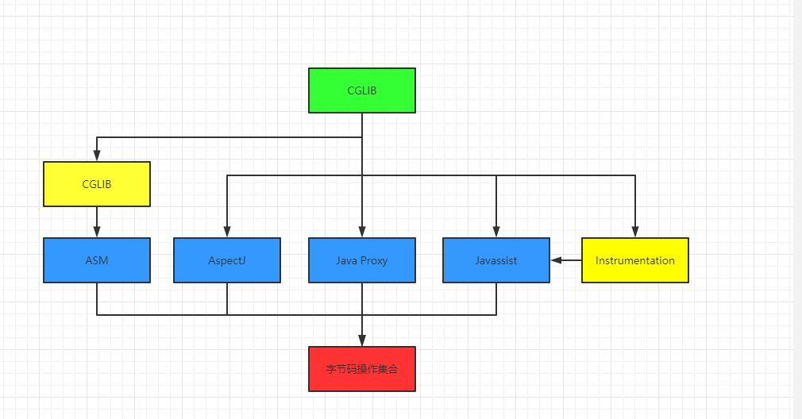
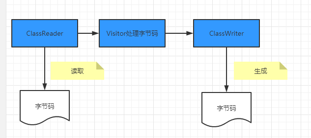
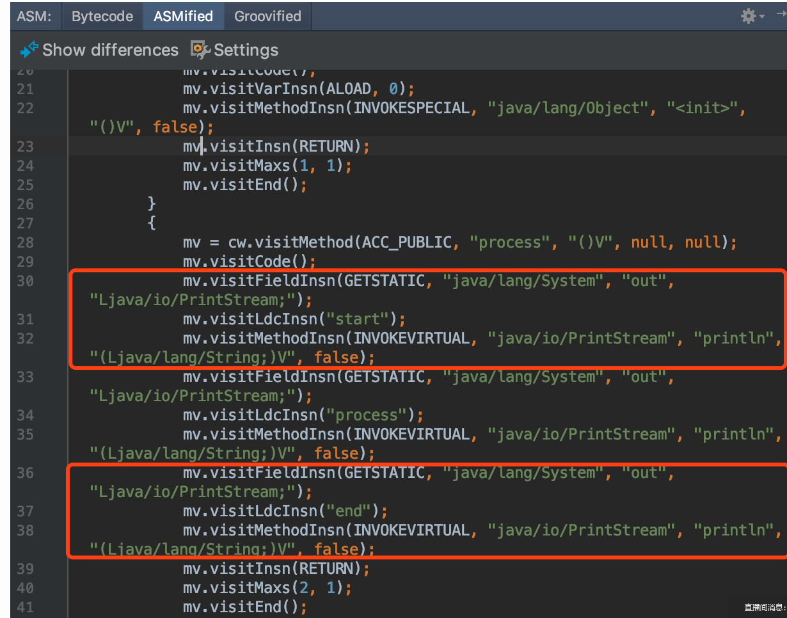

### 字节码增强技术探索
---
#### 字节码
##### 什么是字节码
  “一次编译，到处运行”：一是java是跨平台的，因为JVM针对各操作系统、平台进行了定制。二是JVM对任何平台都可以生成固定格式的字节码文件(.class)供JVM使用。
字节码文件由十六进制值组成，而JVM以两个十六进制值为一组，为一个字节。
  javac命令编译源码为字节码文件,一个.java文件从编译到运行的示例如图所示。
  
  对于开发人员，了解字节码可以更准确、直观地理解Java语言中更深层次的东西，比如通过字节码，可以很直观地看到Volatile关键字如何在字节码上生效。
  另外，字节码增强技术在Spring AOP、各种ORM框架、热部署中的应用屡见不鲜，深入理解其原理对于我们来说大有裨益。
  除此之外，由于JVM规范的存在，只要最终可以生成符合规范的字节码就可以在JVM上运行，因此这就给了各种运行在JVM上的语言（如Scala、Groovy、Kotlin）一种契机，
  可以扩展Java所没有的特性或者实现各种语法糖。理解字节码后再学习这些语言，可以“逆流而上”，从字节码视角看它的设计思路，学习起来也“易如反掌”。
  
### 字节码增强
  字节码增强技术就是一类对现有字节码进行修改或者动态生成全新字节码文件的技术,接下来，我们将从最直接操纵字节码的实现方式开始深入进行剖析。
                                          

#### ASM
  对于需要手动操纵字节码的需求，可以使用ASM，它可以直接生产 .class字节码文件，也可以在类被加载入JVM之前动态修改类行为.
  ASM的应用场景有AOP（Cglib就是基于ASM）、热部署、修改其他jar包中的类等。当然，涉及到如此底层的步骤，实现起来也比较麻烦。接下来，本文将介绍ASM的两种API，并用ASM来实现一个比较粗糙的AOP。
  访问者模式：  
    object-oriented programming and software engineering, the visitor design pattern is a way of separating an algorithm from an object structure on which it operates. A practical result of this separation is the ability to add new operations to existing object structures without modifying the structures. It is one way to follow the open/closed principle.
    In essence, the visitor allows adding new virtual functions to a family of classes, without modifying the classes. Instead, a visitor class is created that implements all of the appropriate specializations of the virtual function. The visitor takes the instance reference as input, and implements the goal through double dispatch.
    在面向对象的程序设计和软件工程中，访问者 设计模式是一种将算法与操作对象的结构分离的一种方法。这种分离的实际结果是能够在不修改结构的情况下向现有对象结构添加新操作。这是遵循开放/封闭原则的一种方法。
    本质上，访问者允许在不修改类的情况下将新的虚函数添加到类的族中。而是创建一个访问者类，该类实现虚拟函数的所有适当专业化。访问者将实例引用作为输入，并通过double dispatch实现目标。
    (过double dispatch 在软件工程中，双重调度是多重调度的一种特殊形式，它是一种机制，可以根据调用中涉及的两个对象的运行时类型，将函数调用分派给不同的具体函数。在大多数面向对象的系统中，从代码中的函数调用中调用的具体函数取决于单个对象的动态类型，因此，它们被称为单个调度调用，或简称为虚函数调用。    
    Dan Ingalls首先描述了如何在Smalltalk中使用双重调度，称其为多态。)
    简单来说，访问者模式主要用于修改或操作一些数据结构比较稳定的数据，我们知道字节码文件的结构是由JVM固定的，所以很适合利用访问者模式对字节码文件进行修改。
    
      
  
##### ASM API

核心API
  ASM Core API可以类比解析XML文件中的SAX方式，不需要把这个类的整个结构读取进来，就可以用流式的方法来处理字节码文件。好处是非常节约内存，但是编程难度较大。然而出于性能考虑，一般情况下编程都使用Core API。在Core API中有以下几个关键类：
  1 ClassReader：用于读取已经编译好的.class文件。
  2 ClassWriter：用于重新构建编译后的类，如修改类名、属性以及方法，也可以生成新的类的字节码文件。
  各种Visitor类：如上所述，CoreAPI根据字节码从上到下依次处理，对于字节码文件中不同的区域有不同的Visitor，比如用于访问方法的MethodVisitor、用于访问类变量的FieldVisitor、用于访问注解的AnnotationVisitor等。为了实现AOP，重点要使用的是MethodVisitor。
树形API
 ASM Tree API可以类比解析XML文件中的DOM方式，把整个类的结构读取到内存中，缺点是消耗内存多，但是编程比较简单。TreeApi不同于CoreAPI，TreeAPI通过各种Node类来映射字节码的各个区域，类比DOM节点，就可以很好地理解这种编程方式。

##### 直接利用ASM实现AOP
  利用ASM的CoreAPI来增强类。这里不纠结于AOP的专业名词如切片、通知，只实现在方法调用前、后增加逻辑，通俗易懂且方便理解。首先定义需要被增强的Base类：其中只包含一个process()方法，方法内输出一行“process”。增强后，我们期望的是，方法执行前输出“start”，之后输出”end”。
 ```java
public class Base {
    public void process(){
        System.out.println("process");
    }
} 
```
  为了利用ASM实现AOP，需要定义两个类：一个是MyClassVisitor类，用于对字节码的visit以及修改；另一个是Generator类，在这个类中定义ClassReader和ClassWriter，其中的逻辑是，classReader读取字节码，然后交给MyClassVisitor类处理，处理完成后由ClassWriter写字节码并将旧的字节码替换掉。Generator类较简单，我们先看一下它的实现，如下所示，然后重点解释MyClassVisitor类。
```java
import org.objectweb.asm.ClassReader;
import org.objectweb.asm.ClassVisitor;
import org.objectweb.asm.ClassWriter;

public class Generator {
    public static void main(String[] args) throws Exception {
		//读取
        ClassReader classReader = new ClassReader("meituan/bytecode/asm/Base");
        ClassWriter classWriter = new ClassWriter(ClassWriter.COMPUTE_MAXS);
        //处理
        ClassVisitor classVisitor = new MyClassVisitor(classWriter);
        classReader.accept(classVisitor, ClassReader.SKIP_DEBUG);
        byte[] data = classWriter.toByteArray();
        //输出
        File f = new File("operation-server/target/classes/meituan/bytecode/asm/Base.class");
        FileOutputStream fout = new FileOutputStream(f);
        fout.write(data);
        fout.close();
        System.out.println("now generator cc success!!!!!");
    }
}
```
  MyClassVisitor继承自ClassVisitor，用于对字节码的观察。它还包含一个内部类MyMethodVisitor，继承自MethodVisitor用于对类内方法的观察，它的整体代码如下：
  ```java
import org.objectweb.asm.ClassVisitor;
import org.objectweb.asm.MethodVisitor;
import org.objectweb.asm.Opcodes;

public class MyClassVisitor extends ClassVisitor implements Opcodes {
    public MyClassVisitor(ClassVisitor cv) {
        super(ASM5, cv);
    }
    @Override
    public void visit(int version, int access, String name, String signature,
                      String superName, String[] interfaces) {
        cv.visit(version, access, name, signature, superName, interfaces);
    }
    @Override
    public MethodVisitor visitMethod(int access, String name, String desc, String signature, String[] exceptions) {
        MethodVisitor mv = cv.visitMethod(access, name, desc, signature,
                exceptions);
        //Base类中有两个方法：无参构造以及process方法，这里不增强构造方法
        if (!name.equals("<init>") && mv != null) {
            mv = new MyMethodVisitor(mv);
        }
        return mv;
    }
    class MyMethodVisitor extends MethodVisitor implements Opcodes {
        public MyMethodVisitor(MethodVisitor mv) {
            super(Opcodes.ASM5, mv);
        }

        @Override
        public void visitCode() {
            super.visitCode();
            mv.visitFieldInsn(GETSTATIC, "java/lang/System", "out", "Ljava/io/PrintStream;");
            mv.visitLdcInsn("start");
            mv.visitMethodInsn(INVOKEVIRTUAL, "java/io/PrintStream", "println", "(Ljava/lang/String;)V", false);
        }
        @Override
        public void visitInsn(int opcode) {
            if ((opcode >= Opcodes.IRETURN && opcode <= Opcodes.RETURN)
                    || opcode == Opcodes.ATHROW) {
                //方法在返回之前，打印"end"
                mv.visitFieldInsn(GETSTATIC, "java/lang/System", "out", "Ljava/io/PrintStream;");
                mv.visitLdcInsn("end");
                mv.visitMethodInsn(INVOKEVIRTUAL, "java/io/PrintStream", "println", "(Ljava/lang/String;)V", false);
            }
            mv.visitInsn(opcode);
        }
    }
}  
```  
  利用这个类就可以实现对字节码的修改。详细解读其中的代码，对字节码做修改的步骤是：
  
  首先通过MyClassVisitor类中的visitMethod方法，判断当前字节码读到哪一个方法了。跳过构造方法 <init> 后，将需要被增强的方法交给内部类MyMethodVisitor来进行处理。
  接下来，进入内部类MyMethodVisitor中的visitCode方法，它会在ASM开始访问某一个方法的Code区时被调用，重写visitCode方法，将AOP中的前置逻辑就放在这里。
  MyMethodVisitor继续读取字节码指令，每当ASM访问到无参数指令时，都会调用MyMethodVisitor中的visitInsn方法。我们判断了当前指令是否为无参数的“return”指令，如果是就在它的前面添加一些指令，也就是将AOP的后置逻辑放在该方法中。
  综上，重写MyMethodVisitor中的两个方法，就可以实现AOP了，而重写方法时就需要用ASM的写法，手动写入或者修改字节码。通过调用methodVisitor的visitXXXXInsn()方法就可以实现字节码的插入，XXXX对应相应的操作码助记符类型，比如mv.visitLdcInsn(“end”)对应的操作码就是ldc “end”，即将字符串“end”压入栈。
  完成这两个visitor类后，运行Generator中的main方法完成对Base类的字节码增强，增强后的结果可以在编译后的target文件夹中找到Base.class文件进行查看，可以看到反编译后的代码已经改变了（如图18左侧所示）。然后写一个测试类MyTest，在其中new Base()，并调用base.process()方法，可以看到下图右侧所示的AOP实现效果：

##### ASM工具

利用ASM手写字节码时，需要利用一系列visitXXXXInsn()方法来写对应的助记符，所以需要先将每一行源代码转化为一个个的助记符，然后通过ASM的语法转换为visitXXXXInsn()这种写法。第一步将源码转化为助记符就已经够麻烦了，不熟悉字节码操作集合的话，需要我们将代码编译后再反编译，才能得到源代码对应的助记符。第二步利用ASM写字节码时，如何传参也很令人头疼。ASM社区也知道这两个问题，所以提供了工具ASM ByteCode Outline。
安装后，右键选择“Show Bytecode Outline”，在新标签页中选择“ASMified”这个tab，如图19所示，就可以看到这个类中的代码对应的ASM写法了。图中上下两个红框分别对应AOP中的前置逻辑于后置逻辑，将这两块直接复制到visitor中的visitMethod()以及visitInsn()方法中，就可以了。

     
  
#### Javassist

  ASM是在指令层次上操作字节码的，阅读上文后，我们的直观感受是在指令层次上操作字节码的框架实现起来比较晦涩。故除此之外，我们再简单介绍另外一类框架：强调源代码层次操作字节码的框架Javassist。
  
  利用Javassist实现字节码增强时，可以无须关注字节码刻板的结构，其优点就在于编程简单。直接使用java编码的形式，而不需要了解虚拟机指令，就能动态改变类的结构或者动态生成类。其中最重要的是ClassPool、CtClass、CtMethod、CtField这四个类：
  
  CtClass（compile-time class）：编译时类信息，它是一个class文件在代码中的抽象表现形式，可以通过一个类的全限定名来获取一个CtClass对象，用来表示这个类文件。
  ClassPool：从开发视角来看，ClassPool是一张保存CtClass信息的HashTable，key为类名，value为类名对应的CtClass对象。当我们需要对某个类进行修改时，就是通过pool.getCtClass(“className”)方法从pool中获取到相应的CtClass。
  CtMethod、CtField：这两个比较好理解，对应的是类中的方法和属性。
  了解这四个类后，我们可以写一个小Demo来展示Javassist简单、快速的特点。我们依然是对Base中的process()方法做增强，在方法调用前后分别输出”start”和”end”，实现代码如下。我们需要做的就是从pool中获取到相应的CtClass对象和其中的方法，然后执行method.insertBefore和insertAfter方法，参数为要插入的Java代码，再以字符串的形式传入即可，实现起来也极为简单。

```java
import com.meituan.mtrace.agent.javassist.*;

public class JavassistTest {
    public static void main(String[] args) throws NotFoundException, CannotCompileException, IllegalAccessException, InstantiationException, IOException {
        ClassPool cp = ClassPool.getDefault();
        CtClass cc = cp.get("meituan.bytecode.javassist.Base");
        CtMethod m = cc.getDeclaredMethod("process");
        m.insertBefore("{ System.out.println(\"start\"); }");
        m.insertAfter("{ System.out.println(\"end\"); }");
        Class c = cc.toClass();
        cc.writeFile("/Users/zen/projects");
        Base h = (Base)c.newInstance();
        h.process();
    }
}
```

---
*[👈 0000 Java目录](../../0000Java目录.md)*

*[415 出品，必属精品](../../../note.md)*使用