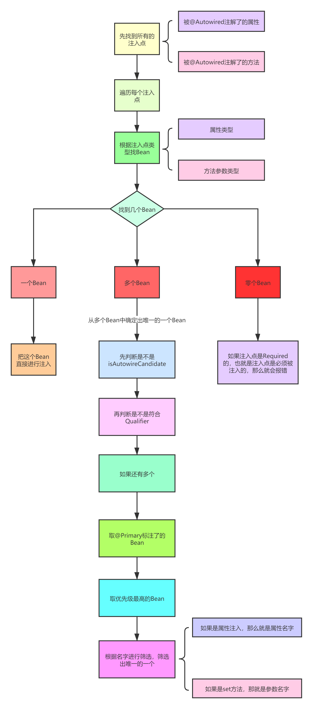

### Spring中的依赖注入(上)

---
#### Spring中有几种属性注入的方式？
  首先分两种：手动注入、自动注入
  
#### 手动注入
- 在XML中定义Bean时，就是手动注入，因为是程序员手动给某个属性指定了值,这种底层是通过set方法进行注入。
```xml
<bean name="userService" class="com.luban.service.UserService">
    <property name="orderService" ref="orderService"/>
</bean>
```
- 构造方法注入
```xml
<bean name="userService" class="com.luban.service.UserService">
    <constructor-arg index="0" ref="orderService"/>
</bean>
```
所以手动注入的底层也就是分为两种：
1. set方法
2. 构造方法

#### 自动注入

- XML的utowire自动注入

在XML中，我们可以在定义一个Bean时去指定这个Bean的自动注入模式：
1. byType
2. byName
3. constructor
4. default
5. no

```xml
<bean id="userService" class="com.luban.service.UserService" autowire="byType"/>
```
这么写，表示Spring会自动的给userService中所有的属性自动赋值（不需要这个属性上有@Autowired注解，但需要这个属性有对应的set方法）。

在创建Bean的过程中，在填充属性时，Spring会去解析当前类，把当前类的所有方法都解析出来，Spring会去解析每个方法得到对应的PropertyDescriptor对象，注意PropertyDescriptor并不是Spring中的类，而是java.beans包下类，也就是jdk自带的类，PropertyDescriptor中有几个属性：
1. name：这个name并不是方法的名字，而是拿方法名字进过处理后的名字
a. 如果方法名字以“get”开头，比如“getXXX”,那么name=XXX
b. 如果方法名字以“is”开头，比如“isXXX”,那么name=XXX
c. 如果方法名字以“set”开头，比如“setXXX”,那么name=XXX
2. readMethodRef：表示get方法的Method对象的引用
3. readMethodName：表示get方法的名字
4. writeMethodRef：表示set方法的Method对象的引用
5. writeMethodName：表示set方法的名字
6. propertyTypeRef：如果有get方法那么对应的就是返回值的类型，如果是set方法那么对应的就是set方法中唯一参数的类型
get方法的定义是： 方法参数个数为0个，并且 （方法名字以"get"开头 或者 方法名字以"is"开头并且方法的返回类型为boolean）
set方法的定义是：方法参数个数为1个，并且 （方法名字以"set"开头并且方法返回类型为void）
所以，Spring在通过byName的自动填充属性时流程是：
1. 找到所有set方法所对应的XXX部分的名字
2. 根据XXX部分的名字去获取bean
Spring在通过byType的自动填充属性时流程是：
1. 找到所有set方法所对应的XXX部分的名字
2. 根据XXX部分的名字重新再获取得到PropertyDescriptor
3. 获取到set方法中的唯一参数的类型，并且根据该类型去容器中获取bean
4. 如果找到多个，会报错。
以上，分析了autowire的byType和byName情况，那么接下来分析constructor，constructor表示通过构造方法注入，其实这种情况就比较简单了，没有byType和byName那么复杂。
首先，如果是byType或byName，那么该bean一定要有一个无参的构造方法，因为如果只有有参构造方法，那么Spring将无法进行实例化，因为Spring如果要实例化肯定需要利用构造方法，而Spring没法给构造方法传值。
然后，如果是constructor，那么就可以不写set方法了，当某个bean是通过构造方法来注入时，表示Spring在利用构造方法实例化一个对象时，可以利用构造方法的参数信息从Spring容器中去找bean，找到bean之后作为参数传给构造方法，从而实例化得到一个bean对象。
我们这里先不考虑一个类有多个构造方法的情况，后面单独讲推断构造方法。我们这里只考虑只有一个有参构造方法。
其实构造方法注入相当于byType+byName，普通的byType是根据set方法中的参数类型去找bean，找到多个会报错，而constructor就是通过构造方法中的参数类型去找bean，如果找到多个会根据参数名确定。
另外两个：
1. no，表示关闭autowire
2. default，表示默认值，我们一直演示的某个bean的autowire，而也可以直接在<beans>标签中设置autowire，如果设置了，那么<bean>标签中设置的autowire如果为default，那么则会用<beans>标签中设置的autowire。
可以发现XML中的自动注入是挺强大的，那么问题来了，为什么我们平时都是用的@Autowired注解呢？而没有用上文说的这种自动注入方式呢？
@Autowired注解相当于XML中的autowire属性的注解方式的替代。这是在官网上有提到的。
```text
Essentially, the @Autowired annotation provides the same capabilities as described in Autowiring Collaborators but with more fine-grained control and wider applicability
```
翻译一下：
从本质上讲，@Autowired注解提供了与autowire相同的功能，但是拥有更细粒度的控制和更广泛的适用性。
- 注意：更细粒度的控制。
XML中的autowire控制的是整个bean的所有属性，而@Autowired注解是直接写在某个属性、set方法、构造方法上的。
再举个例子，如果一个类有多个构造方法，那么如果用XML的autowire=constructor，你无法控制到底用哪个构造方法，而你可以用@Autowired注解来直接指定你想用哪个构造方法。
同时，用@Autowired注解，还可以控制，哪些属性想被自动注入，哪些属性不想，这也是细粒度的控制。
但是@Autowired无法区分byType和byName，@Autowired是先byType，如果找到多个则byName。
那么XML的自动注入底层其实也就是:
1. set方法
2. 构造方法
自动注入又分为两种：
1. XML的autowire自动注入
2. @Autowired注解的自动注入

上文说了@Autowired注解，是byType和byName的结合。
@Autowired注解可以写在：
1. 属性上：先根据属性类型去找Bean，如果找到多个再根据属性名确定一个
2. 构造方法上：先根据方法参数类型去找Bean，如果找到多个再根据参数名确定一个
3. set方法上：先根据方法参数类型去找Bean，如果找到多个再根据参数名确定一个
而这种底层到了：
1. 属性
2. set方法
3. 构造方法

#### @Autowired底层实现原理

- 找出注入点
在创建一个Bean的过程中，Spring会利用AutowiredAnnotationBeanPostProcessor的postProcessMergedBeanDefinition()找出注入点，加了@Autowired注解的就是注入点，比如：
1. 某个属性
2. 某个方法（先不管构造方法）
把这些注入点信息找出来之后会进行缓存中（Set<InjectedElement>），InjectedElement就表示注入点
- 进行注入
Spring会利用AutowiredAnnotationBeanPostProcessor的postProcessProperties()方法中，会遍历Set<InjectedElement>中的注入点开始进行注入。
•
---
*[👈 0000 Java目录](../../0000Java目录.md)*

*[415 出品，必属精品](../../../note.md)*