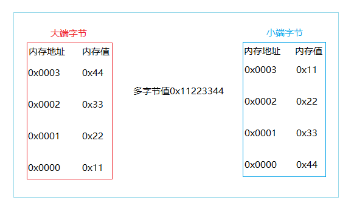

### Network Byte Order [code](demo/NetworkByteOrder/NetworkByteOrder_test.go)

网络字节序分“大端”，“小端”两种，表示多字节值的地位还是高位存储在该值的起始地址处。
- 多字节值的低位存在内存的低地址处，则为小端字节序。
- 多字节值的高位存在内存的低地址处，则为大端字节序。




UDP/TCP/IP协议规定:<font color=red>把接收到的第一个字节当作高位字节看待,这就要求发送端发送的第一个字节是高位字节;而在发送端发送数据时,发送的第一个字节是该数值在内存中的起始地址处对应的那个字节,也就是说,该数值在内存中的起始地址处对应的那个字节就是要发送的第一个高位字节。</font>

所以：网络字节序就是大端字节序, 有些系统的本机字节序是小端字节序, 有些则是大端字节序, 为了保证传送顺序的一致性, 所以网际协议使用大端字节序来传送数据。

### 主机字节序

网络字节序是确定的，即内存起始位置必然是高位字节，则一定为大端字节序，而主机字节序是由CPU架构决定的，可以使用如下的代码查看自己机器的字节序：

```golang
package byteorder_test

import (
	"fmt"
	"testing"
	"unsafe"
)

func TestGetOrder(t *testing.T) {
	var a = 0x11223344
	// fmt.Printf("%x\n", *(*byte)(unsafe.Pointer(&a)))
	if *(*int8)(unsafe.Pointer(&a)) == 0x44 {
		fmt.Println("small")
	} else {
		fmt.Println("big")
	}
}
```
Golang 是强类型语言，不允许不同类型的指针之间进行强制转化，因此需要借助 unsafe.Pointer 进行一次中转。