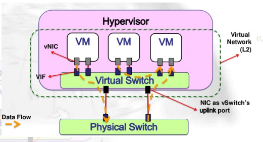
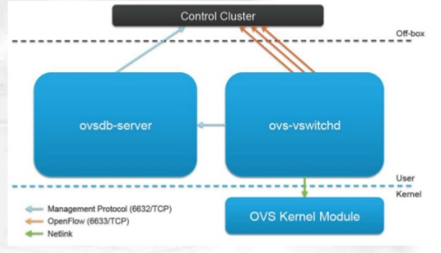
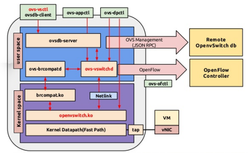
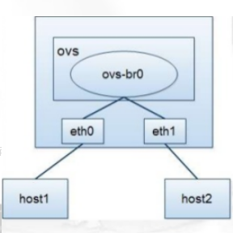
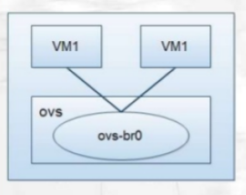

### OVS（Open vSwitch）虚拟交换技术

#### Open vSwitch是什么？
OVS是一个虚拟交换机，主要用于虚拟化技术中网络通讯，跟传统的交换机相比OVS具有灵活配置，成本低廉的优势。

#### 虚拟网络

在虚拟化技术中，虚拟机之间的网络通讯都是通过虚拟网络实现的，通过一个图片来看，图中绿色的部分是就是虚拟网络



虚拟机的网络通过与虚拟交换机交互完成网络数据的定向传递，虚拟交换机直接和物理口交互，对外看起来就只有物理口的通讯，但是内部却可以虚拟出更丰富的网络结构。而OVS就是负责做这个虚拟网络的软件实现，OVS主要工作在二层，也就是链路层，目前不具备三层路由功能。

#### OVS架构

OVS由三大组件构成



- ovsdb-sever:OVS数据库服务，用来存储虚拟交换机的配置信息
- ovs-vswitch:核心组件，和上层的control通过openflow协议通讯，与ovsdb-server使用OVSDB协议通讯，和内核模块通过netlink系统调用的方式通信，支持多个独立的datapath（datapath可以理解为网桥），通过这个组件更改流表实现流量的转发等功能。
-  ovs kernel module:OVS的内核模块，处理包交换，缓存flow，如果内核流表中有规则，根据规则转发，否则交给用户态去处理。

#### OVS架构详解



- ovs-vswitchd 为主要模块，实现交换机的守护进程daemon
- openvswitch.ko为Linux内核模块，支持数据流在内核的交换
- ovsdb-server 轻量级数据库服务器，保存配置信息，ovs-vswitchd通过这个数据库获取配置信息
- ovs-brcompatd 让ovs-vswitch替换Linuxbridge，包括获取bridge ioctls的Linux内核模块；
- ovs-dpctl 用来配置switch内核模块；一些Scripts and specs 辅助OVS安装在Citrix XenServer上，作为默认switch；
- ovs-vsctl 查询和更新ovs-vswitchd的配置；
- ovs-appctl 发送命令消息，运行相关daemon；
- ovs-ofctl 查询和控制OpenFlow交换机和控制器； 
- openflow 一个简单的OpenFlow交换机；
- controller 一个简单的OpenFlow控制器；

**运行原理：**
内核模块实现了多个datapath（数据路径，类似于网桥），每个都可以有多个“vports”（类似于桥内的端口）。每个数据路径也通过关联一下流表（flow table）来设置操作，而这些流表中的流都是用户空间在报文头和元数据的基础上映射的关键信息，一般的操作都是将数据包转发到另一个vport。当一个数据包到达一个vport，内核模块所做的处理是提取其流的关键信息并在流表中查找这些关键信息。当有一个匹配的流时它执行对应的操作。如果没有匹配，它会将数据包送到用户空间的处理队列中（作为处理的一部分，用户空间可能会设置一个流用于以后碰到相同类型的数据包可以在内核中执行操作）。


#### 简单示例

1.物理机之间通过虚拟交换机通讯




```
ovs-vsctl add-br br0
ovs-vsctl add-port br0 eth0
ovs-vsctl add-port br0 eth1
```

2.物理机上不同虚拟机


