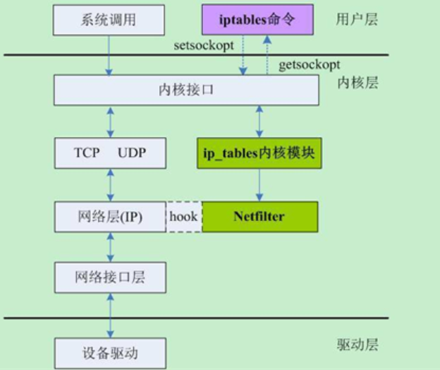
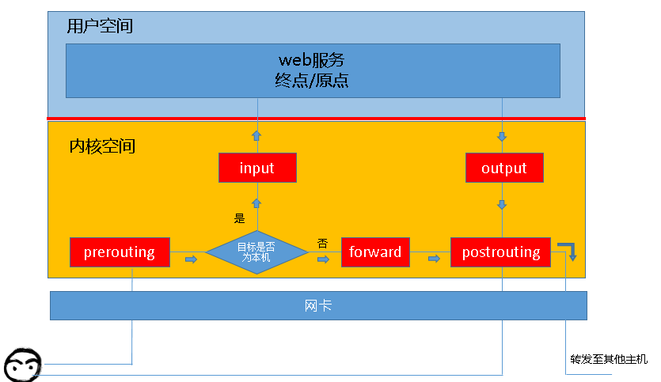
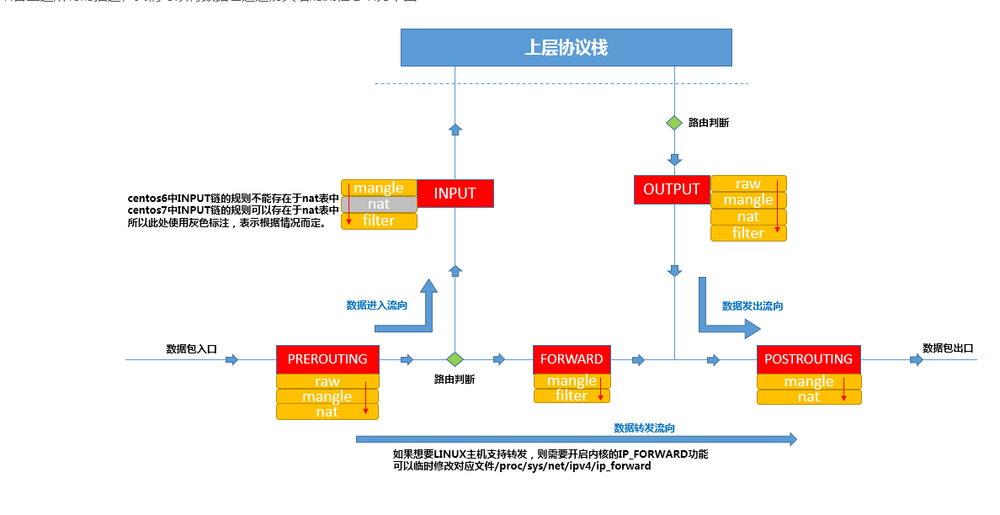

## iptables（一）详解

### 防火墙相关概念
从逻辑上讲。防火墙可以大体分为主机防火墙和网络防火墙：
主机防火墙：针对于单个主机进行防护。
网络防火墙：往往处于网络入口或边缘，针对于网络入口进行防护，服务于防火墙背后的本地局域网。
网络防火墙和主机防火墙并不冲突，可以理解为，网络防火墙主外（集体）， 主机防火墙主内（个人）。

从物理上讲，防火墙可以分为硬件防火墙和软件防火墙：
硬件防火墙：在硬件级别实现部分防火墙功能，另一部分功能基于软件实现，性能高，成本高。
软件防火墙：应用软件处理逻辑运行于通用硬件平台之上的防火墙，性能低，成本低。

### netfilter简介
iptables其实不是真正的防火墙，我们可以把它理解成一个客户端代理，用户通过iptables这个代理，将用户的安全设定执行到对应的”安全框架”中，这个”安全框架”才是真正的防火墙，这个框架的名字叫netfilter。

netfilter才是防火墙真正的安全框架（framework），netfilter位于内核空间。
netfilter可以进行多种网络相关的自定义操作如：
连接跟踪模块（raw）
网络地址转换模块（nat）
数据报修改模块（mangle）
以及数据包过滤的防火墙功能（filter）

netfilter 在 Linux 内核中表现为一系列的hook, 并允许Linux 内核模块注册为回调函数，Linux内核模块通过回调函数操作网络报文。hook点其实就对应了iptables的五个链的位置。
如图展示了netfilter，iptables在内核中存在的位置。

### iptables基础
iptables其实是一个命令行工具，位于用户空间，我们用这个工具操作真正的框架netfilter。
通俗讲，iptables是一个命令行工具，配置防火墙的主要工作就是添加、修改和删除这些规则。规则其实就是网络管理员预定义的条件，规则一般的定义为”如果数据包头符合这样的条件，就这样处理这个数据包”。规则存储在内核空间的信息包过滤表中，这些规则分别指定了源地址、目的地址、传输协议（如TCP、UDP、ICMP）和服务类型（如HTTP、FTP和SMTP）等。当数据包与规则匹配时，iptables就根据规则所定义的方法来处理这些数据包，如放行（accept）、拒绝（reject）和丢弃（drop）等。

如图，一次web应用请求，客户端需要发送一个IP:PORT指向目标终点上。这个IP:PORT地址需要经由内核处理，最终转发的目标端。而在内核空间的处理逻辑就需要经由防火墙netfilter来处理，netfilter框架引用iptables配置的规则来保证网络安全。

iptables规则由四表五链来完成。

#### 五链
链（chains）是数据包传播的路径，每一条链其实就是众多规则中的一个检查清单，每一条链中可以有一 条或数条规则。当一个数据包到达一个链时，iptables就会从链中第一条规则开始检查，看该数据包是否满足规则所定义的条件。如果满足，系统就会根据 该条规则所定义的方法处理该数据包；否则iptables将继续检查下一条规则，如果该数据包不符合链中任一条规则，iptables就会根据该链预先定 义的默认策略来处理数据包。

##### PREROUTING
对数据包作路由选择前应用此链中的规则。
（所有的数据包进来的时侯都先由这个链处理）
##### INPUT
进来的数据包应用此规则链中的策略。
##### FORWARD
转发数据包时应用此规则链中的策略。
##### OUTPUT
外出的数据包应用此规则链中的策略。
##### POSTROUTING
对数据包作路由选择后应用此链中的规则。
（所有的数据包出来的时侯都先由这个链处理）

#### 四表
表（tables）提供特定的功能，iptables内置了4个表，即filter表、nat表、mangle表和raw表，分别用于实现包过滤，网络地址转换、包重构(修改)和数据跟踪处理。

##### raw
关闭nat表上启用的连接追踪机制；iptable_raw。
##### mangle
拆解报文，做出修改，并重新封装 的功能；iptable_mangle。
##### nat
network address translation，网络地址转换功能；内核模块：iptable_nat。
##### filter
负责过滤功能，防火墙；内核模块;iptables_filter。

表的优先级顺序：raw-mangle-nat-filter。

#### 表与链的关系
表中有链，链中也有表，表和链是不同层面上的概念。表是按照功能划分，链是按照在处理流程的位置来区分的。
最终的执行流程图如下。

#### 规则
根据指定的匹配条件来尝试匹配每个流经此处的报文，一旦匹配成功，则由规则后面指定的处理动作进行处理；
规则由匹配条件和处理动作组成。

#### 规则匹配条件
基本配置条件：
源地址 Source IP,目标地址 Destination IP。

扩展匹配条件：
需要依赖特定的扩展模块。如
源端口Source Port,目标端口 Destination Port。

#### 处理动作
处理动作在iptables中被称为target。

ACCEPT: 允许数据包通过。

DROP：直接丢弃数据包，不给任何回应信息，客户端只能等待超时。

REJECT：拒绝数据包通过，必要时给数据发送端回应一个相应信息，客户端就会收到拒绝的信息。

SNAT：源地址转换，解决内网用户用同一个公网地址上网的问题。

MASQUEREDE：是SNAT的一种特殊形式，适用于动态的，临时会变的ip上。

DNAT：目标地址转换。

REDIRECT：在本机做端口映射。

LOG：在/var/log/message文件记录日志信息，然后发送给下一条规则。

