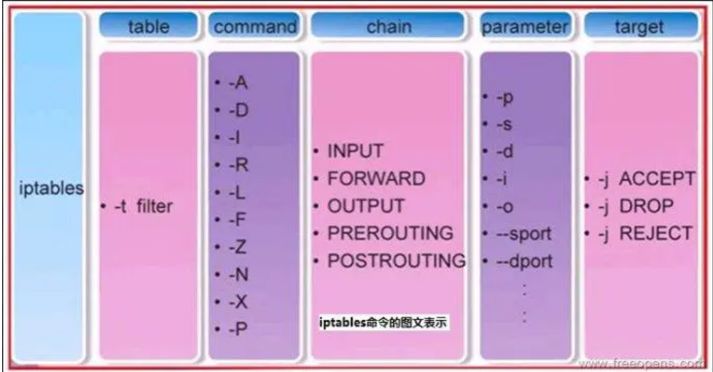
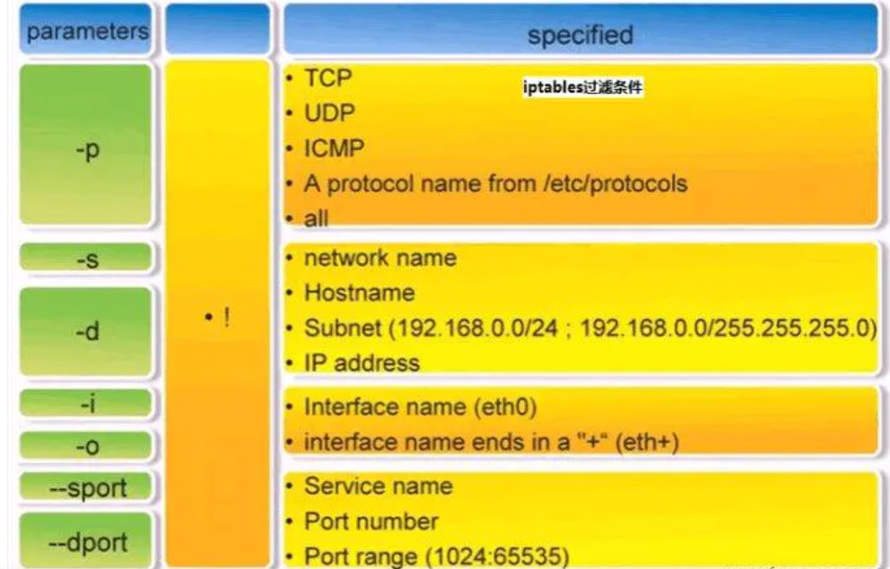

### iptables（二）使用
#### 命令格式
iptables [-t 表名] 命令选项 ［链名］ ［条件匹配］ ［-j 目标动作或跳转］




##### 管理控制选项
-A  在指定链的末尾添加（append）一条新的规则
-D  删除（delete）指定链中的某一条规则，可以按规则序号和内容删除
-I  在指定链中插入（insert）一条新的规则，默认在第一行添加
-L  列出（list）指定链中所有的规则进行查看
-F  清空（flush）

-R  修改、替换（replace）指定链中的某一条规则，可以按规则序号和内容替换
-E  重命名用户定义的链，不改变链本身
-N  新建（new-chain）一条用户自己定义的规则链
-X  删除指定表中用户自定义的规则链（delete-chain）
-P  设置指定链的默认策略（policy）
-Z  将所有表的所有链的字节和数据包计数器清零
-n  使用数字形式（numeric）显示输出结果
-v  查看规则表详细信息（verbose）的信息
-V  查看版本(version)
-h  获取帮助（help）

##### 目标动作或跳转
ACCEPT 允许数据包通过
DROP 直接丢弃数据包，不给任何回应信息
REJECT 拒绝数据包通过，必要时会给数据发送端一个响应的信息。
LOG在/var/log/messages文件中记录日志信息，然后将数据包传递给下一条规则

##### 匹配条件
常用条件如下：
参数 -p, --protocol
参数 -s, --src, --source
参数 -d, --dst, --destination
参数 -i, --in-interface
参数 -o, --out-interface
参数 --sport, --source-port
参数 --dport, --destination-port
参数 --tcp-flags
参数 --syn
参数 -m multiport --source-port
参数 -m multiport --destination-port
参数 -m multiport --port
参数 --icmp-type
iptables -p icmp --help 可以查看具体哪些参数可用
参数 -m limit --limit
参数 --limit-burst
参数 -m mac --mac-source
参数 --mark
参数 -m owner --uid-owner
参数 -m owner --gid-owner
参数 -m owner --pid-owner
参数 -m owner --sid-owner
参数 -m state --state

详细参考
https://www.cnblogs.com/fanweisheng/p/11130208.html

##### iptables防火墙规则的保存与恢复
iptables-save把规则保存到文件中，再由目录rc.d下的脚本（/etc/rc.d/init.d/iptables）自动装载。
使用命令iptables-save来保存规则。一般用
```
iptables-save > /etc/sysconfig/iptables
```
也可以用
```
service iptables save
```
它能把规则自动保存在/etc/sysconfig/iptables中。
当计算机启动时，rc.d下的脚本将用命令iptables-restore调用这个文件，从而就自动恢复了规则。


#### iptables防火墙常用策略
拒绝进入防火墙的所有ICMP协议数据包
```
iptables -I INPUT -p icmp -j REJECT
```
允许防火墙转发除ICMP协议以外的所有数据包 
```
iptables -A FORWARD -p ! icmp -j ACCEPT
```
拒绝转发来自192.168.1.10主机的数据，允许转发来自192.168.0.0/24网段的数据
```
iptables -A FORWARD -s 192.168.1.11 -j REJECT
iptables -A FORWARD -s 192.168.0.0/24 -j ACCEPT
```
丢弃从外网接口（eth1）进入防火墙本机的源地址为私网地址的数据包
```
iptables -A INPUT -i eth1 -s 192.168.0.0/16 -j DROP
iptables -A INPUT -i eth1 -s 172.16.0.0/12 -j DROP
iptables -A INPUT -i eth1 -s 10.0.0.0/8 -j DROP
```
封堵网段（192.168.1.0/24），两小时后解封。
```
iptables -I INPUT -s 10.20.30.0/24 -j DROP
iptables -I FORWARD -s 10.20.30.0/24 -j DROP
at now 2 hours at> iptables -D INPUT 1 at> iptables -D FORWARD 1
```
只允许管理员从202.13.0.0/16网段使用SSH远程登录防火墙主机。
```
iptables -A INPUT -p tcp --dport 22 -s 202.13.0.0/16 -j ACCEPT
iptables -A INPUT -p tcp --dport 22 -j DROP
```
允许本机开放从TCP端口20-1024提供的应用服务。
```
iptables -A INPUT -p tcp --dport 20:1024 -j ACCEPT
iptables -A OUTPUT -p tcp --sport 20:1024 -j ACCEPT
```
允许转发来自192.168.0.0/24局域网段的DNS解析请求数据包。
```
iptables -A FORWARD -s 192.168.0.0/24 -p udp --dport 53 -j ACCEPT
iptables -A FORWARD -d 192.168.0.0/24 -p udp --sport 53 -j ACCEPT
```
禁止其他主机ping防火墙主机，但是允许从防火墙上ping其他主机
```
iptables -I INPUT -p icmp --icmp-type Echo-Request -j DROP
iptables -I INPUT -p icmp --icmp-type Echo-Reply -j ACCEPT
iptables -I INPUT -p icmp --icmp-type destination-Unreachable -j ACCEPT
```
禁止转发来自MAC地址为00：0C：29：27：55：3F的和主机的数据包
```
iptables -A FORWARD -m mac --mac-source 00:0c:29:27:55:3F -j DROP
说明：iptables中使用“-m 模块关键字”的形式调用显示匹配。咱们这里用“-m mac –mac-source”来表示数据包的源MAC地址。
```
允许防火墙本机对外开放TCP端口20、21、25、110以及被动模式FTP端口1250-1280
```
iptables -A INPUT -p tcp -m multiport --dport 20,21,25,110,1250:1280 -j ACCEPT
说明：这里用“-m multiport –dport”来指定目的端口及范围
```
禁止转发源IP地址为192.168.1.20-192.168.1.99的TCP数据包。
```
iptables -A FORWARD -p tcp -m iprange --src-range 192.168.1.20-192.168.1.99 -j DROP
说明：此处用“-m –iprange –src-range”指定IP范围。
```
禁止转发与正常TCP连接无关的非—syn请求数据包。
```
iptables -A FORWARD -m state --state NEW -p tcp ! --syn -j DROP
说明：“-m state”表示数据包的连接状态，“NEW”表示与任何连接无关的，新的嘛！
```
拒绝访问防火墙的新数据包，但允许响应连接或与已有连接相关的数据包
```
iptables -A INPUT -p tcp -m state --state NEW -j DROP
iptables -A INPUT -p tcp -m state --state ESTABLISHED,RELATED -j ACCEPT
说明：“ESTABLISHED”表示已经响应请求或者已经建立连接的数据包，“RELATED”表示与已建立的连接有相关性的，比如FTP数据连接等。
```
只开放本机的web服务（80）、FTP(20、21、20450-20480)，放行外部主机发住服务器其它端口的应答数据包，将其他入站数据包均予以丢弃处理。
```
iptables -I INPUT -p tcp -m multiport --dport 20,21,80 -j ACCEPT
iptables -I INPUT -p tcp --dport 20450:20480 -j ACCEPT
iptables -I INPUT -p tcp -m state --state ESTABLISHED -j ACCEPT
iptables -P INPUT DROP
```

#### 常用的iptables规则
删除所有
```
iptables -F
```
设置默认chain策略
```
iptables -P INPUT DROP
iptables -P FORWARD DROP
iptables -P OUTPUT DROP
```
更多使用参考
https://www.jianshu.com/p/ee4ee15d3658


#### 自定义规则链
在filter表新增规则链
```
iptables -t filter -N newChan
```
在新增规则链中新增规则
```
iptables -t filter -I newChan -s 10.1.1.1 -j DROP
```
在规则中引用新增规则链
```
iptables -t filter -I INPUT -s 10.1.1.1 -j newChan
```